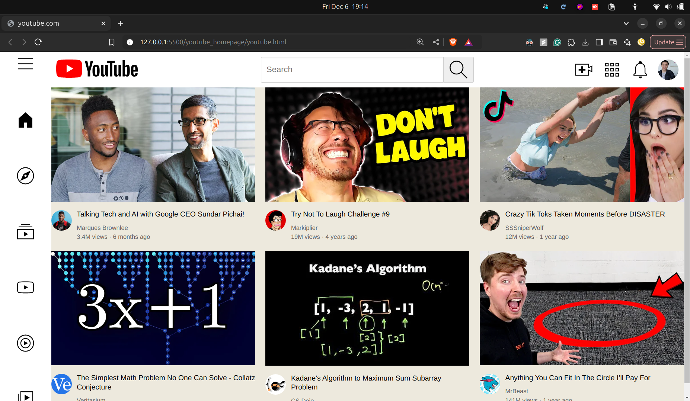

# YouTube Homepage Clone

This is a simple project replicating YouTube's homepage using vanilla HTML. It showcases the structure and layout of a modern website, focusing on static content and fundamental web development techniques.

## Features

- **Static Layout**: Mimics YouTube's homepage layout, including headers, video thumbnails, and a sidebar.
- **Responsive Design**: Ensures the design looks good on different screen sizes using basic HTML structure and principles.
- **Clean Code**: Written entirely in vanilla HTML, emphasizing simplicity and readability.

## Project Structure

```plaintext
youtube_homepage/
|-- youtube.html       # Main HTML file
|-- channel-pics/
|-- icons/
|-- menu-icons/
|-- misc/
|-- style-icons/
|-- thumbnails/
```

## How to Run

1. Clone this repository to your local machine:

   ```bash
   git clone <repository-url>
   ```

2. Navigate to the project directory:

   ```bash
   cd youtube_homepage
   ```

3. Open the `index.html` file in any modern web browser to view the project:
   ```
   open youtube.html
   ```

## Future Improvements

- **CSS Styling**: Adding CSS for better aesthetics and styling.
- **JavaScript**: Including interactivity like video hover effects and dynamic content loading.
- **Backend Integration**: Connecting to a backend for real-time content updates.

## Screenshots



## Contributing

Contributions are welcome! If you find any issues or have ideas for improvement, feel free to open an issue or submit a pull request.

### Acknowledgements

- Inspired by YouTube’s homepage design.
- Created using vanilla HTML to demonstrate core web development skills.
- Reffered: https://www.youtube.com/watch?v=G3e-cpL7ofc&t=14507s&ab_channel=SuperSimpleDev
- Channel: https://www.youtube.com/@SuperSimpleDev

---

Feel free to reach out with feedback or suggestions. Enjoy exploring the project!
